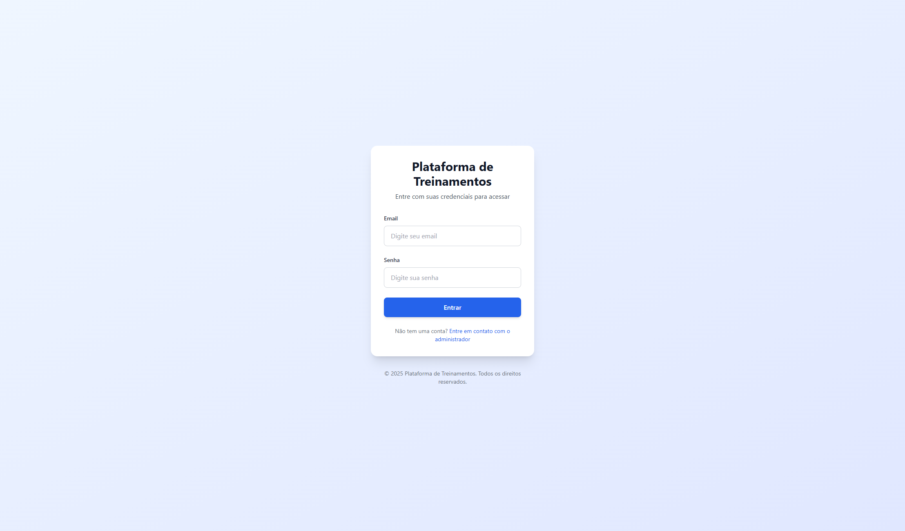
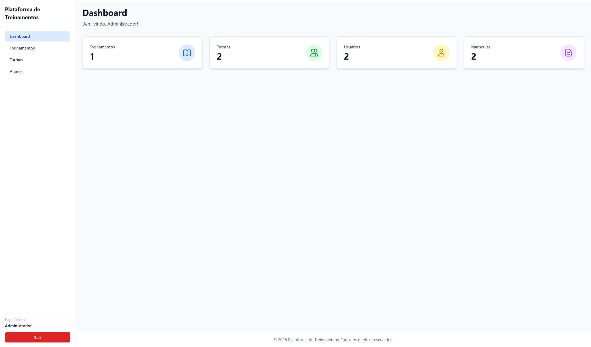
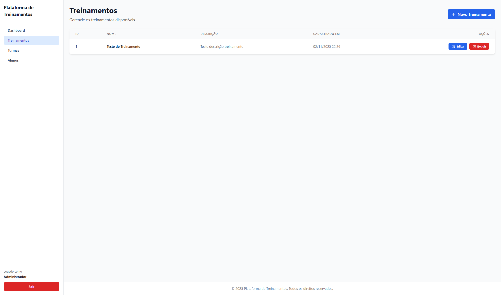
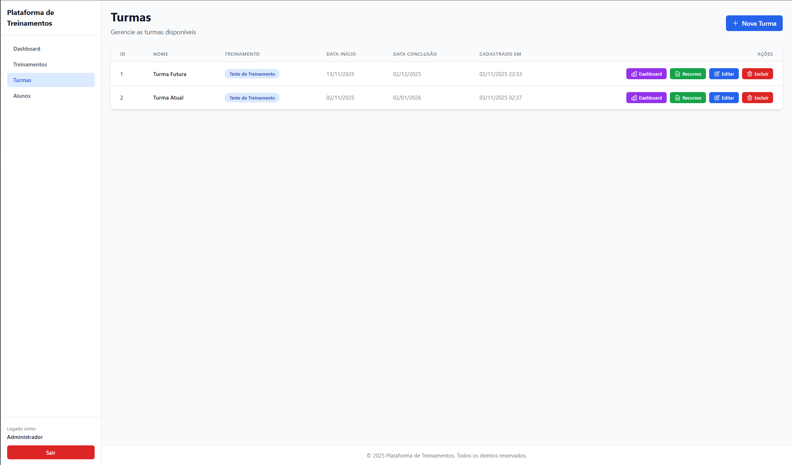
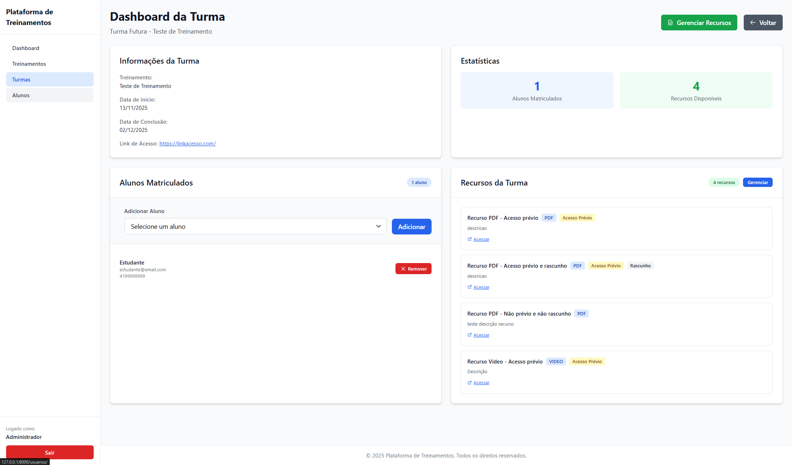
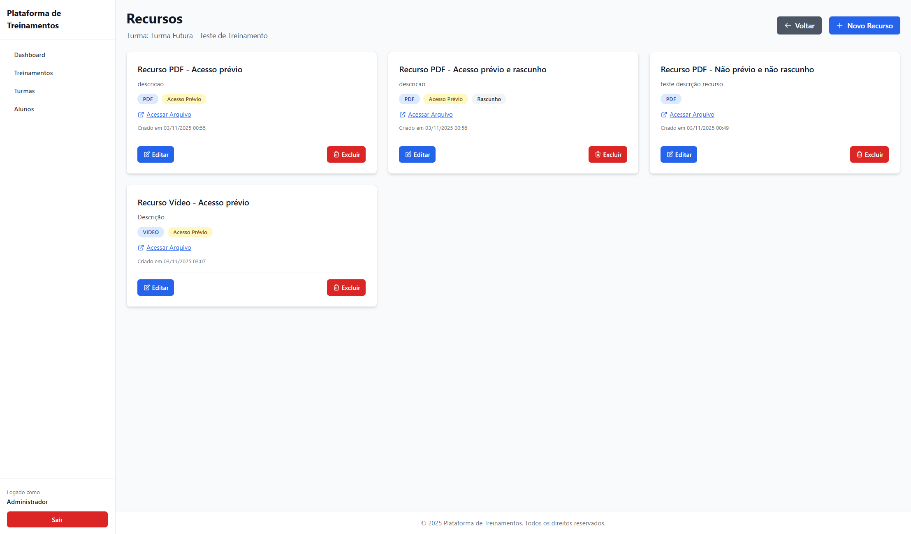
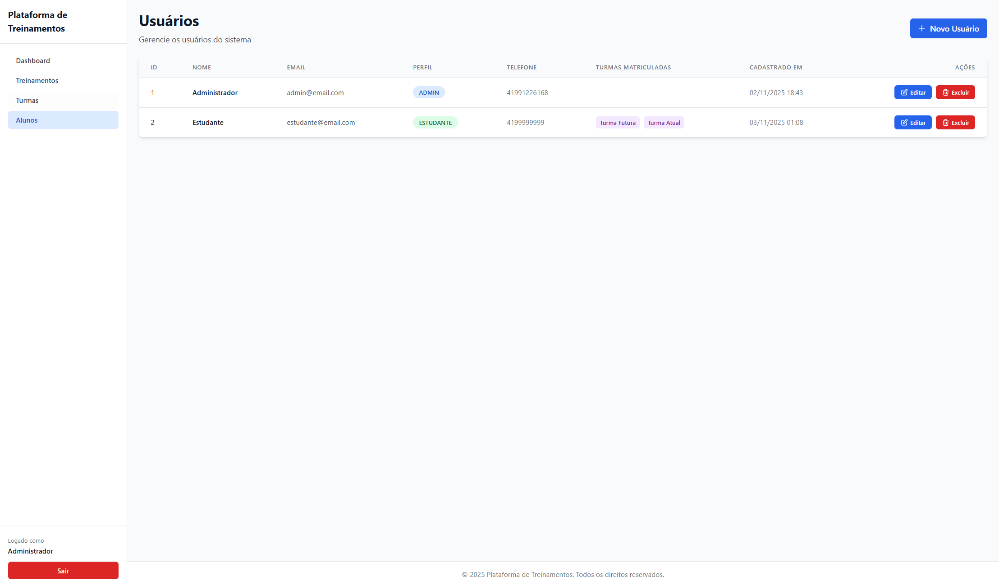
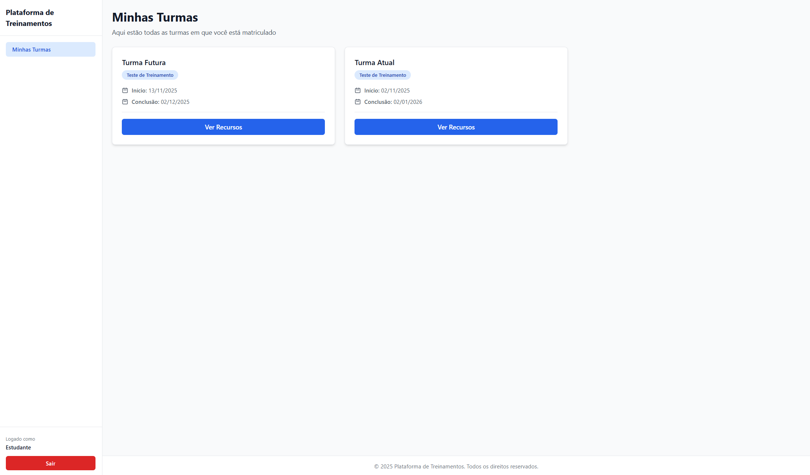
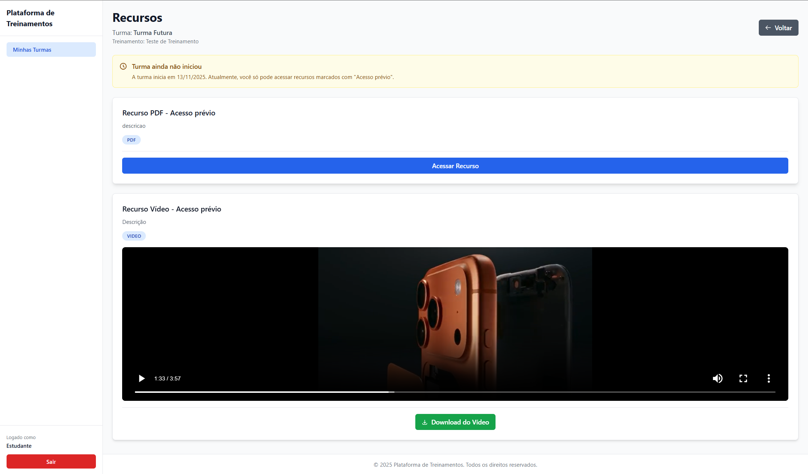

# Plataforma de Treinamentos

Sistema web para gerenciamento de treinamentos, turmas e recursos educacionais, com perfis diferenciados para administradores e estudantes.

## Visão Geral

A **Plataforma de Treinamentos** é uma aplicação Django que permite:

- **Administradores**: cadastrar Treinamentos, Turmas, Recursos (vídeos, PDFs, links) e gerenciar matrículas de estudantes
- **Estudantes**: acessar turmas matriculadas e visualizar recursos conforme regras de acesso baseadas em datas e configurações (acesso prévio, rascunho)

### Tecnologias Utilizadas

- **Backend**: Django 5.2.7
- **Banco de Dados**: MySQL 8.0+
- **Frontend**: HTML5, Tailwind CSS (via CDN), JavaScript
- **Autenticação**: Sistema customizado com email/senha
- **Upload de Arquivos**: Sistema nativo Django com armazenamento local

### Principais Funcionalidades

- Sistema de autenticação customizado (email/senha)
- CRUD completo para Treinamentos, Turmas, Recursos e Usuários
- Regras de acesso a recursos baseadas em data de início da turma
- Player de vídeo HTML5 integrado
- Upload e gerenciamento de arquivos (vídeos, PDFs, etc.)
- Dashboard administrativo com estatísticas
- Área restrita por perfil (Admin/Estudante)

## Screenshots

As capturas de tela do sistema estão disponíveis na pasta `screenshots/`:

### Autenticação


*Tela de login do sistema - Autenticação por email e senha*

### Área Administrativa


*Dashboard administrativo com estatísticas gerais (treinamentos, turmas, usuários, matrículas)*


*CRUD de treinamentos - Listagem, criação, edição e exclusão*


*CRUD de turmas na área administrativa - Gerenciamento completo de turmas*


*Dashboard detalhado de uma turma - Visualização de alunos matriculados e recursos, com opções de adicionar/remover alunos*


*Gerenciamento de recursos da turma - Listagem em cards com opções de criar, editar e excluir*


*CRUD de usuários/alunos - Listagem com informações de perfil e turmas matriculadas*

### Área do Estudante


*Listagem de turmas do estudante - Visualização apenas das turmas em que está matriculado*


*Visualização de recursos pelo estudante - Player de vídeo HTML5 e opções de download*


## Requisitos

### Versões Mínimas

- **Python**: 3.10 ou superior
- **MySQL**: 8.0 ou superior (ou MariaDB 10.3+)
- **pip**: Versão mais recente
- **Git**: Para clonar o repositório

### Ferramentas Recomendadas

- **MySQL Workbench** ou **phpMyAdmin**: Para importar dump SQL
- **Editor de código**: VS Code, PyCharm ou similar
- **Terminal**: PowerShell (Windows) ou Bash (Unix/macOS)

## Estrutura de Pastas

```
.
├─ apps/
│  ├─ accounts/          # Autenticação e gerenciamento de usuários
│  ├─ classesapp/        # Gerenciamento de turmas
│  ├─ enrollments/       # Sistema de matrículas
│  ├─ resourcesapp/      # Recursos educacionais (vídeos, PDFs, links)
│  └─ trainings/         # Treinamentos e turmas
├─ media/                # Arquivos enviados pelos usuários
│  ├─ videos/           # Vídeos organizados por turma
│  └─ recursos/         # Outros recursos organizados por turma
├─ project/              # Configurações do projeto Django
│  ├─ __pycache__/
│  ├─ __init__.py
│  ├─ asgi.py
│  ├─ settings.py        # Configurações (banco de dados, apps, etc.)
│  ├─ urls.py            # URLs principais
│  └─ wsgi.py
├─ screenshots/          # Capturas de tela do sistema
├─ templates/            # Templates HTML Django
│  ├─ admin/            # Templates da área administrativa
│  ├─ aluno/            # Templates da área do estudante
│  └─ auth/             # Templates de autenticação
├─ workbench/
│  └─ dumps/            # Dumps SQL para importação
├─ .venv/               # Ambiente virtual Python (ignorar em produção)
└─ manage.py            # Script de gerenciamento Django
```

## Configuração de Ambiente

### Windows (PowerShell)

```powershell
# Criar ambiente virtual
py -m venv .venv

# Ativar ambiente virtual
.\.venv\Scripts\Activate.ps1

# Atualizar pip
py -m pip install --upgrade pip

# Instalar dependências
pip install -r requirements.txt
```

**Nota**: Se encontrar erro de política de execução, execute primeiro:
```powershell
Set-ExecutionPolicy -ExecutionPolicy RemoteSigned -Scope CurrentUser
```

### Unix/macOS (Bash)

```bash
# Criar ambiente virtual
python3 -m venv .venv

# Ativar ambiente virtual
source .venv/bin/activate

# Atualizar pip
pip install --upgrade pip

# Instalar dependências
pip install -r requirements.txt
```

### Criar arquivo requirements.txt

Se o arquivo `requirements.txt` não existir, crie-o com o seguinte conteúdo:

```txt
Django>=5.2.0
mysqlclient>=2.2.0
```

Ou instale diretamente:

```powershell
pip install Django mysqlclient
```

## Banco de Dados (Deploy Local)

**⚠️ Ordem de Execução Importante**:

Execute nesta ordem:
1. ✅ **Importe o dump SQL**: `workbench/dumps/plataformatreinamentos.sql`
2. ✅ **Rode as migrações**: `python manage.py migrate`
3. ✅ **Crie o superusuário**: `python manage.py createsuperuser`

### Importando o Dump SQL

O projeto utiliza um **dump SQL** pré-configurado localizado em `workbench/dumps/` para popular o banco de dados com dados reais (perfis, usuários, treinamentos, turmas, etc.).

#### Passos para Importação:

1. **Criar o schema no MySQL**:
   ```sql
   CREATE DATABASE plataformatreinamentos CHARACTER SET utf8mb4 COLLATE utf8mb4_unicode_ci;
   ```

2. **Importar o dump SQL**:
   
   O arquivo a ser importado é: **`workbench/dumps/plataformatreinamentos.sql`**
   
   - **MySQL Workbench**: 
     - Abra o MySQL Workbench
     - Conecte-se ao servidor local
     - Menu: `Server` → `Data Import`
     - Selecione `Import from Self-Contained File`
     - Escolha o arquivo `workbench/dumps/plataformatreinamentos.sql`
     - Destination Schema: `plataformatreinamentos`
     - Clique em `Start Import`
   
   - **Linha de comando (Windows)**:
     ```powershell
     mysql -u root -p plataformatreinamentos < workbench\dumps\plataformatreinamentos.sql
     ```
   
   - **Linha de comando (Unix/macOS)**:
     ```bash
     mysql -u root -p plataformatreinamentos < workbench/dumps/plataformatreinamentos.sql
     ```

3. **Verificar importação**:
   ```sql
   USE plataformatreinamentos;
   SHOW TABLES;
   ```
   
   Você deve ver as tabelas: `perfil`, `usuario`, `treinamento`, `turma`, `recurso`, `matricula`, entre outras.

### Configuração no settings.py

O arquivo `project/settings.py` já está pré-configurado para conexão local. Ajuste as credenciais conforme necessário:

```python
DATABASES = {
    'default': {
        'ENGINE': 'django.db.backends.mysql',
        'NAME': 'plataformatreinamentos',
        'USER': 'root',              # Ajuste se necessário
        'PASSWORD': '',              # Ajuste conforme sua senha
        'HOST': '127.0.0.1',
        'PORT': '3306',
        'OPTIONS': {
            'charset': 'utf8mb4',
            'init_command': "SET sql_mode='STRICT_TRANS_TABLES'",
        },
    }
}
```

**Importante**: Algumas tabelas são gerenciadas fora do Django (models com `managed=False`). As migrations do Django afetam apenas apps nativos e tabelas onde o ORM gerencia completamente.

## Variáveis de Ambiente / Configurações

### Configuração Direta

Atualmente, as configurações estão diretamente no `project/settings.py`. Porém é somente para o teste técnico. Para maior segurança em produção, recomenda-se usar variáveis de ambiente.

## Migrações e Superusuário

### Aplicar Migrações

Após importar o dump SQL, execute as migrações do Django:

**Windows (PowerShell)**:
```powershell
python manage.py migrate
```

**Unix/macOS (Bash)**:
```bash
python3 manage.py migrate
```

**Importante**: Apenas as tabelas gerenciadas pelo Django serão afetadas. As tabelas principais (`usuario`, `perfil`, `treinamento`, `turma`, `recurso`, `matricula`) já devem estar no banco após importar o dump SQL.

### Criar Superusuário Django

Para acessar o painel administrativo do Django (`/admin/`), crie um superusuário:

**Windows (PowerShell)**:
```powershell
python manage.py createsuperuser
```

**Unix/macOS (Bash)**:
```bash
python3 manage.py createsuperuser
```

Siga as instruções para informar:
- Username (ou deixe em branco)
- Email (ou deixe em branco)
- Password (será solicitado duas vezes)

**Nota**: O sistema de autenticação principal usa a tabela `usuario` customizada (importada do dump). O superusuário criado aqui é apenas para acesso ao Django Admin (`/admin/`). O login principal do sistema (`/login/`) utiliza os usuários da tabela `usuario` importada do dump SQL.

## Executando a Aplicação

### Coletar Arquivos Estáticos (se necessário)

```powershell
py manage.py collectstatic --noinput
```

### Iniciar o Servidor

```powershell
py manage.py runserver
```

O servidor será iniciado em `http://127.0.0.1:8000/`

### URLs Principais

- **Admin Django**: `/admin/` - Painel administrativo do Django
- **Login**: `/login/` - Tela de autenticação do sistema
- **Dashboard Admin**: `/dashboard/` - Dashboard customizado para administradores
- **Treinamentos**: `/treinamentos/` - CRUD de treinamentos (admin)
- **Turmas**: `/turmas/` - CRUD de turmas (admin)
- **Usuários**: `/usuarios/` - CRUD de usuários (admin)
- **Área do Estudante**: `/aluno/turmas/` - Listagem de turmas do estudante
- **Recursos da Turma**: `/aluno/turma/{id}/recursos/` - Recursos da turma (estudante)

### Credenciais Padrão (do dump)

Consulte o arquivo de dump ou a documentação fornecida para credenciais de usuários de teste.

## Testes do Código

### Testes Automatizados

Execute todos os testes:

```powershell
py manage.py test
```

Para testes específicos de uma app:

```powershell
py manage.py test apps.accounts
py manage.py test apps.resourcesapp
py manage.py test apps.trainings
```

#### Cobertura dos Testes

Os testes automatizados cobrem:

- **Autenticação**: Login com email/senha, verificação de perfil
- **Regras de Acesso a Recursos**: 
  - Visibilidade antes/depois da data de início
  - Filtragem de recursos com acesso prévio
  - Exclusão de recursos em rascunho
- **Matrículas**: Verificação de turmas por estudante
- **CRUD de Entidades**: Criação, edição e exclusão
- **Permissões**: Verificação de acesso por perfil (admin/estudante)

### Roteiro de Testes Manuais

#### 1. Login e Autenticação

1. Acesse `/login/`
2. Faça login com usuário **admin**:
   - Deve redirecionar para `/dashboard/`
   - Sidebar deve mostrar: Dashboard, Treinamentos, Turmas, Alunos
3. Faça logout e login com usuário **estudante**:
   - Deve redirecionar para `/aluno/turmas/`
   - Sidebar deve mostrar apenas: Minhas Turmas

#### 2. Área Administrativa

1. Acesse `/dashboard/` como admin
2. Verifique estatísticas (total de treinamentos, turmas, usuários, matrículas)
3. Navegue por:
   - `/treinamentos/` - Criar, editar, excluir treinamento
   - `/turmas/` - Criar, editar, excluir turma (com seleção de treinamento)
   - `/usuarios/` - Criar, editar, excluir usuário (com validação de senha)
   - Dashboard de turma (`/turmas/{id}/dashboard/`) - Gerenciar alunos e recursos

#### 3. Área do Estudante

1. Acesse `/aluno/turmas/` como estudante
2. Verifique que aparecem **apenas** turmas em que o estudante está matriculado
3. Clique em "Ver Recursos" de uma turma

#### 4. Regras de Acesso a Recursos

**Teste 1: Turma Futura (antes da data de início)**

1. Crie uma turma com data de início **futura**
2. Adicione recursos:
   - Recurso A: Acesso prévio = ✅, Draft = ❌
   - Recurso B: Acesso prévio = ❌, Draft = ❌
   - Recurso C: Acesso prévio = ✅, Draft = ✅
3. Como estudante, acesse os recursos da turma
4. **Resultado esperado**: Apenas Recurso A deve aparecer

**Teste 2: Turma Iniciada (após data de início)**

1. Crie uma turma com data de início **passada**
2. Adicione recursos:
   - Recurso A: Draft = ❌
   - Recurso B: Draft = ✅
3. Como estudante, acesse os recursos da turma
4. **Resultado esperado**: Apenas Recurso A deve aparecer

#### 5. Player de Vídeo

1. Acesse recursos de uma turma que contenha vídeo
2. Verifique:
   - Player HTML5 funcional
   - Controles de play/pause funcionando
   - Botão "Download do Vídeo" disponível e funcional

#### 6. Upload de Arquivos

1. Como admin, crie um novo recurso do tipo "Vídeo" ou "PDF"
2. Faça upload de um arquivo
3. Verifique que o arquivo foi salvo em `media/videos/turma_{id}/` ou `media/recursos/turma_{id}/`
4. Como estudante, verifique que o recurso está acessível

#### 7. Proteção de Rotas

1. Sem estar logado, tente acessar:
   - `/dashboard/` → Deve redirecionar para `/login/`
   - `/aluno/turmas/` → Deve redirecionar para `/login/`
2. Como estudante, tente acessar:
   - `/treinamentos/` → Deve redirecionar para `/aluno/turmas/`
   - `/turmas/{id}/dashboard/` → Deve redirecionar para `/aluno/turmas/`

## Troubleshooting

### Erro: `Access denied for user 'root'@'localhost'`

**Causa**: Credenciais incorretas ou usuário sem permissão.

**Solução**:
1. Verifique `USER` e `PASSWORD` em `project/settings.py`
2. Confirme que o usuário MySQL tem permissões no schema `plataformatreinamentos`
3. Teste a conexão:
   ```sql
   mysql -u root -p
   USE plataformatreinamentos;
   ```

### Erro: `TemplateDoesNotExist`

**Causa**: Caminho de templates incorreto ou template não encontrado.

**Solução**:
1. Verifique `TEMPLATES[0]['DIRS']` em `settings.py`:
   ```python
   'DIRS': [BASE_DIR / 'templates'],
   ```
2. Confirme que os templates existem em `templates/`
3. Verifique o nome do template no código da view

### Erro: `Table '...' doesn't exist`

**Causa**: Tabelas não foram criadas ou dump não foi importado.

**Solução**:
1. Importe o dump SQL de `workbench/dumps/`
2. Verifique se todas as tabelas foram criadas:
   ```sql
   SHOW TABLES;
   ```
3. Se faltarem tabelas, importe o dump novamente

### Erro: `ImproperlyConfigured` relacionado a apps

**Causa**: App não registrado ou import incorreto.

**Solução**:
1. Verifique `INSTALLED_APPS` em `settings.py`
2. Confirme que todos os apps estão listados:
   ```python
   'apps.accounts',
   'apps.trainings',
   'apps.classesapp',
   'apps.resourcesapp',
   'apps.enrollments'
   ```
3. Verifique imports nos arquivos `views.py` e `urls.py`

### Erro: Conflitos de Migração

**Causa**: Migrations tentando criar tabelas que já existem ou são `managed=False`.

**Solução**:
1. Para tabelas `managed=False`, não execute migrations
2. Se necessário, marque migrations como aplicadas:
   ```powershell
   py manage.py migrate --fake accounts
   ```
3. Execute apenas migrations de apps nativos do Django:
   ```powershell
   py manage.py migrate auth
   py manage.py migrate sessions
   py manage.py migrate admin
   ```

### Erro: `ModuleNotFoundError` ao executar testes

**Causa**: Ambiente virtual não ativado ou dependências não instaladas.

**Solução**:
1. Ative o ambiente virtual:
   ```powershell
   .\.venv\Scripts\Activate.ps1
   ```
2. Instale dependências:
   ```powershell
   pip install -r requirements.txt
   ```

### Vídeo não carrega no player

**Causa**: Caminho do arquivo incorreto ou arquivo não existe.

**Solução**:
1. Verifique se o arquivo existe em `media/videos/turma_{id}/`
2. Confirme que `MEDIA_URL` e `MEDIA_ROOT` estão configurados corretamente
3. Verifique permissões da pasta `media/`
4. Teste o caminho direto: `http://127.0.0.1:8000/media/videos/turma_{id}/arquivo.mp4`

### Upload de arquivo falha

**Causa**: Pasta `media/` sem permissão ou caminho incorreto.

**Solução**:
1. Crie a estrutura de pastas:
   ```powershell
   mkdir media\videos
   mkdir media\recursos
   ```
2. Verifique permissões de escrita na pasta `media/`
3. Confirme `MEDIA_ROOT` em `settings.py` aponta para o caminho correto

## Desenvolvimento

### Estrutura de Apps

- **accounts**: Autenticação, usuários, perfis
- **trainings**: Treinamentos e turmas
- **classesapp**: Gerenciamento de turmas (admin)
- **resourcesapp**: Recursos educacionais
- **enrollments**: Sistema de matrículas

### Padrões do Projeto

- Models com `managed=False` para tabelas existentes no banco
- Autenticação customizada via `EmailBackend`
- Context processors para expor dados globais nos templates
- Services para lógica de negócio (ex: `access_rules.py`)

